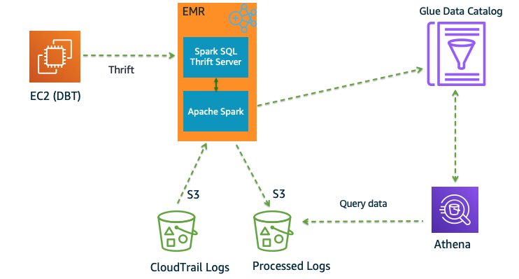
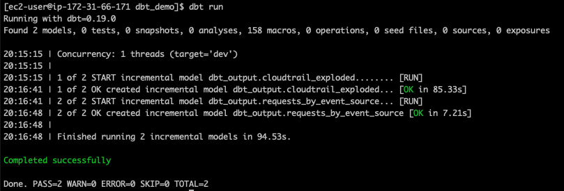
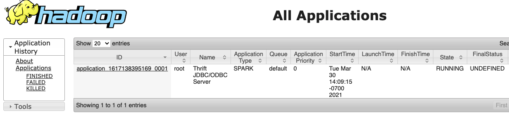
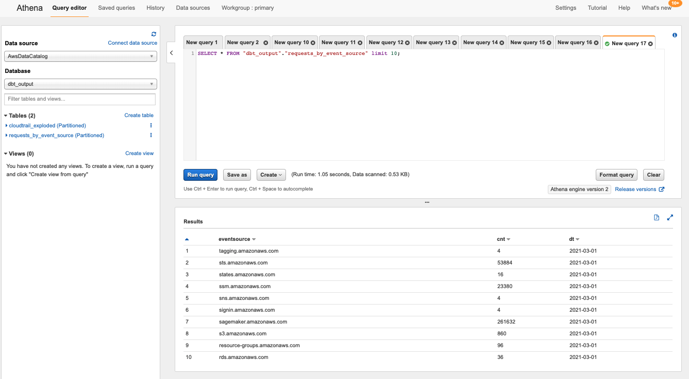

# dbt_spark_emr
DBT Spark with EMR

In this lab we will install DBT on an EC2 instance along with  <a href="https://github.com/fishtown-analytics/dbt-spark">DBT Spark plugin</a> and use it to submit jobs to EMR cluster. DBT will communicate with Spark SQL Thrift Server which will be used to submit the jobs from DBT to EMR cluster. As part of DBT models we will read data from CloudTrail logs S3 bucket, explode the logs and then generate a report to track the requests from eventSource by date. Finally we will use Athena to query the data using Glue Data Catalog.

**Architecture**



```
create database* cloudtrail_raw
```

```
CREATE EXTERNAL TABLE cloudtrail_raw.cloudtrail_event (

     Records array<
        struct<
            additionalEventData:struct<
                AuthenticationMethod:string,
                CipherSuite:string,
                LakeFormationTrustedCallerInvocation:string,
                SignatureVersion:string,
                insufficientLakeFormationPermissions:array<
                    string>,
                lakeFormationPrincipal:string>,
            apiVersion:string,
            awsRegion:string,
            errorCode:string,
            errorMessage:string,
            eventID:string,
            eventName:string,
            eventSource:string,
            eventTime:string,
            eventType:string,
            eventVersion:string,
            readOnly:boolean,
            recipientAccountId:string,
            requestID:string,
            requestParameters:string,
            resources:array<
                struct<
                    ARN:string,
                    accountId:string,
                    type:string>>,
            responseElements:string,
            serviceEventDetails:struct<
                snapshotId:string>,
            sharedEventID:string,
            sourceIPAddress:string,
            userAgent:string,
            userIdentity:struct<
                accessKeyId:string,
                accountId:string,
                arn:string,
                invokedBy:string,
                principalId:string,
                sessionContext:struct<
                    attributes:struct<
                        creationDate:string,
                        mfaAuthenticated:string>,
                    ec2RoleDelivery:string,
                    sessionIssuer:struct<
                        accountId:string,
                        arn:string,
                        principalId:string,
                        type:string,
                        userName:string>>,
                type:string>,
            vpcEndpointId:string>>)

PARTITIONED BY (region string, dt string)
ROW FORMAT SERDE 'org.openx.data.jsonserde.JsonSerDe'
WITH SERDEPROPERTIES ('ignore.malformed.json' = 'true')
STORED AS INPUTFORMAT 'org.apache.hadoop.mapred.TextInputFormat'
OUTPUTFORMAT 'org.apache.hadoop.hive.ql.io.HiveIgnoreKeyTextOutputFormat'
LOCATION 's3://cloudtrail-awslogs-xxx/AWSLogs/xxx/'
```

```
alter TABLE cloudtrail_raw.cloudtrail_event ADD PARTITION (region='us-east-1', dt='2021-03-01')
LOCATION 's3://cloudtrail-awslogs-xxx-/AWSLogs/xxx/CloudTrail/us-east-1/2021/03/01/'
```

```
CREATE DATABASE dbt_demo_out LOCATION 's3://dbt-output/'
```

Launch an EMR Cluster with Spark, select Glue as the metastore for Spark. We will also run a Step on the EMR cluster to start the Spark Thrift Server.

```
aws emr create-cluster --name SparkSQL \
--use-default-roles \--release-label emr-6.1.0 
\--instance-type m4.large --instance-count 2 
\--applications Name=Spark 
\--ec2-attributes KeyName=my_ec2_ssh_key 
\--log-uri s3://my_emr_log_bucket/emr_logs/ 
\--tags Project=dbt_demo 
\--steps Name="Start Thrift Server",Jar=command-runner.jar,Args=sudo,/usr/lib/spark/sbin/start-thriftserver.sh--configurations file://configurations.json
```

**configurations.json**
```
[
{``
"Classification": "spark-hive-site",
"ConfigurationProperties": {
"hive.metastore.client.factory.class": "com.amazonaws.glue.catalog.metastore.AWSGlueDataCatalogHiveClientFactory"
}
}
]
```

Launch an EC2 instance and attach the same security group as EMR-master - ElasticMapReduce-master 

**Install DBT and Spark-DBT on the ec2-instance**

```
sudo yum update -y
sudo yum install -y redhat-rpm-config gcc git python3 libffi-devel openssl-devel
sudo yum install -y gcc-c++ cyrus-sasl-devel python3-devel
pip3 install dbt dbt-spark

# if any errors with pip3 try the following
# pip3 install -U pip
# pip install dbt "dbt-spark[PyHive]"
```

**DBT Project and model creation**

```
mkdir ~./dbt
```

**Create a new DBT project**

```
dbt init dbt_demo
```

**Edit dbt profiles**

```
vim ~/.dbt/profiles.yml

emr_spark_out:
 target: dev
 outputs:
  dev:
   type: spark
   method: thrift
   schema: dbt_demo_output
   host: <IP_ADDRESS_OF_THE_EMR_MASTER_NODE>
   port: 10001
   user: hadoop
```

**Update DBT Models**

```
cd dbt_demo
vim dbt_project.yml

# Name your project! Project names should contain only lowercase characters
# and underscores. A good package name should reflect your organization's
# name or the intended use of these models
name: 'dbt_spark_demo'
version: '1.0.0'
config-version: 2

# This setting configures which "profile" dbt uses for this project.
profile: 'emr_spark_out'

# These configurations specify where dbt should look for different types of files.
# The `source-paths` config, for example, states that models in this project can be
# found in the "models/" directory. You probably won't need to change these!
source-paths: ["models"]
analysis-paths: ["analysis"]
test-paths: ["tests"]
data-paths: ["data"]
macro-paths: ["macros"]
snapshot-paths: ["snapshots"]

target-path: "target"  # directory which will store compiled SQL files
clean-targets:         # directories to be removed by `dbt clean`
    - "target"
    - "dbt_modules"


# Configuring models
# Full documentation: https://docs.getdbt.com/docs/configuring-models

# In this example config, we tell dbt to build all models in the example/ directory
# as tables. These settings can be overridden in the individual model files
# using the `{{ config(...) }}` macro.
models:
  dbt_spark_demo:
      # Applies to all files under models/example/
          materialized: view

```

* Change name from my_new_project to dbt_spark_demo
* Change models from my_new_project to dbt_spark_demo (this value needs to match with the name of the project configured right above)
* Change profile from default to emr_spark_out. This is the name of the profile set in the profiles.yml file in the previous step.

```
cd models
rm -rf examples
```

Copy the model files:<br/>
<a href="cloudtrail_exploded.sql">cloudtrail_exploded.sql</a> - In this model we will explode the cloudtrail logs and extract few fields. The output will be saved in Parquet format and partitioned by region and dt.<br/>
<a href="requests_by_eventsource.sql">requests_by_eventsource.sql</a> - In this model we will create a report that should eventSource, date the count of eventSource. The output will be saved in Parquet format and partitioned by dt.

**Run DBT**



Go to EMR Cluster and Choose YARN Timeline Server.

You should see an application submitted to the EMR cluster



Go to Athena and check the tables and data

